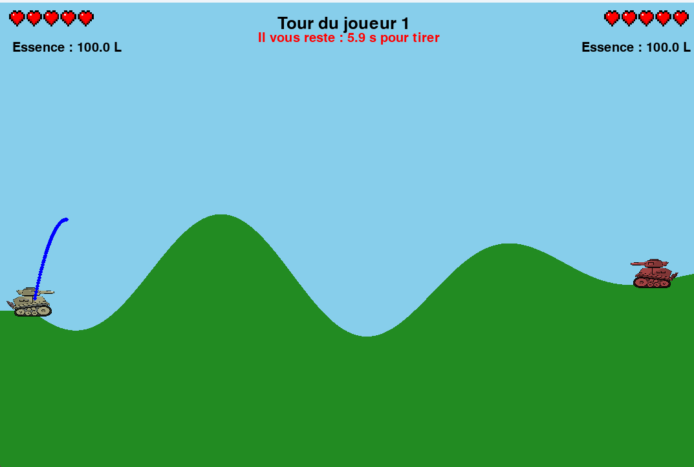
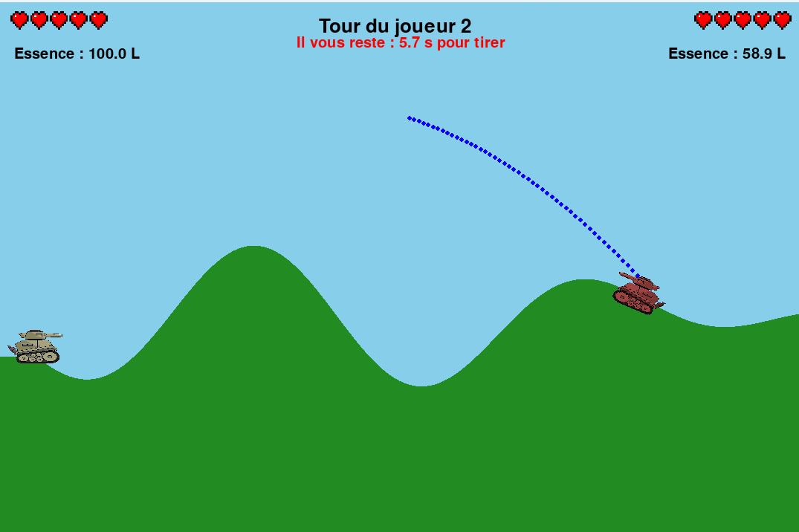
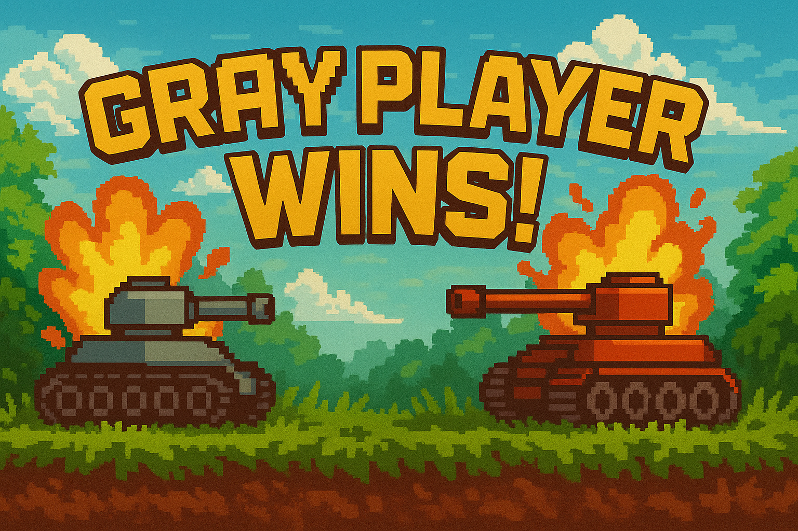
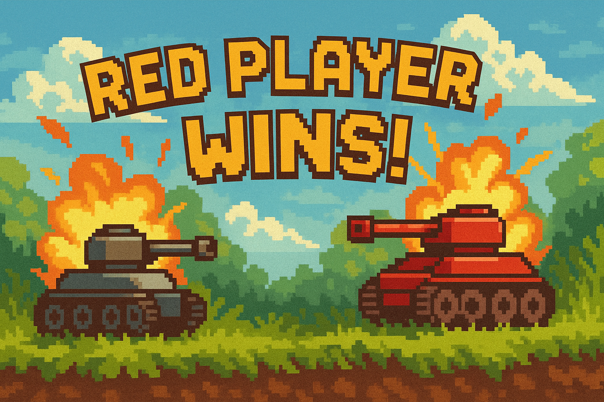

Tank Y est un jeu de combat stratégique en 2D, où deux tanks s’affrontent dans un environnement destructible. Le jeu fonctionne au tour par tour et combine déplacement limité, tir de précision et gestion de la puissance de feu.

Gameplay
Deux joueurs s’affrontent chacun leur tour.

Chaque tank dispose de 5 points de vie.

À chaque tour :

Vous pouvez vous déplacer pendant un court moment (limité par une jauge d’essence).

Vous pouvez tirer une seule fois.

Le but est de réduire les points de vie de l’adversaire à zéro en visant stratégiquement.

Technologies utilisées
Python 3

Pygame : moteur de rendu du jeu

Tkinter : interface des menus

Contrôles :

Se déplacer	: Flèche gauche / droite
Régler la puissance	: Flèche haut / bas
Tirer : Espace

## Attention pour accéder au menu de départ il faut lancer le jeu depuis le fichier Menu.py

Équipe de développement :

Clément : génération des terrains

Manon & Ulysse : physique du jeu et interface

Hugo & Ulysse : trajectoire de tir

Guillaume : menu

Capture d'écran :

